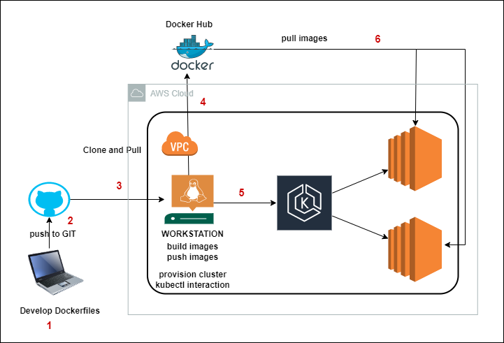

<<<<<<< HEAD
EKS K8S cluster 
---------------
### Note: This is for Lab purpose, Not for PROD purpose

Provision EKS Cluster
----------------------
* Below software are mandatory to provision EKS Cluster
    * eksctl 
    * AWS CLI V2
    * kubectl
* We can create one EC2 Server and use it as work station to create EKS Cluster

## Steps
* Create IAM Admin user with CLI access, It generates Access Key and Secret key. `Don't keep this in any version control like GitHub, GitLab, etc.`
* Install AWS CLI, by default AWS instance gets V1, We need to upgrade to V2
```
curl "https://awscli.amazonaws.com/awscli-exe-linux-x86_64.zip" -o "awscliv2.zip"
unzip awscliv2.zip
sudo ./aws/install --bin-dir /usr/local/bin --install-dir /usr/local/aws-cli --update
```
* Logout and Login again
* Install latest eksctl
```
curl --silent --location "https://github.com/weaveworks/eksctl/releases/latest/download/eksctl_$(uname -s)_amd64.tar.gz" | tar xz -C /tmp

sudo mv /tmp/eksctl /usr/local/bin

eksctl version
```
* Install kubectl, maximum one version less than EKS version
```
curl -O https://s3.us-west-2.amazonaws.com/amazon-eks/1.24.10/2023-01-30/bin/linux/amd64/kubectl
chmod +x kubectl
sudo mv kubectl /usr/local/bin/kubectl
```
* eksctl is the popular tool to provision EKS Cluster. We make use of spot instances to save the cost

```yaml
---
apiVersion: eksctl.io/v1alpha5
kind: ClusterConfig
metadata: 
  name: spot-cluster
  region: us-west-2
managedNodeGroups: 
# `instanceTypes` defaults to [`m5.large`]
  - name: spot1
    spot: true
    ssh: 
      publicKeyName: terrformuser  
```
* To create cluster with above config yaml file
```
eksctl create cluster --config-file=[file-name].yaml
```
* `Note`: Don't forget to delete the cluster
```
eksctl delete cluster --config-file=[file-name].yaml
```

* THANK YOU FOR READING!